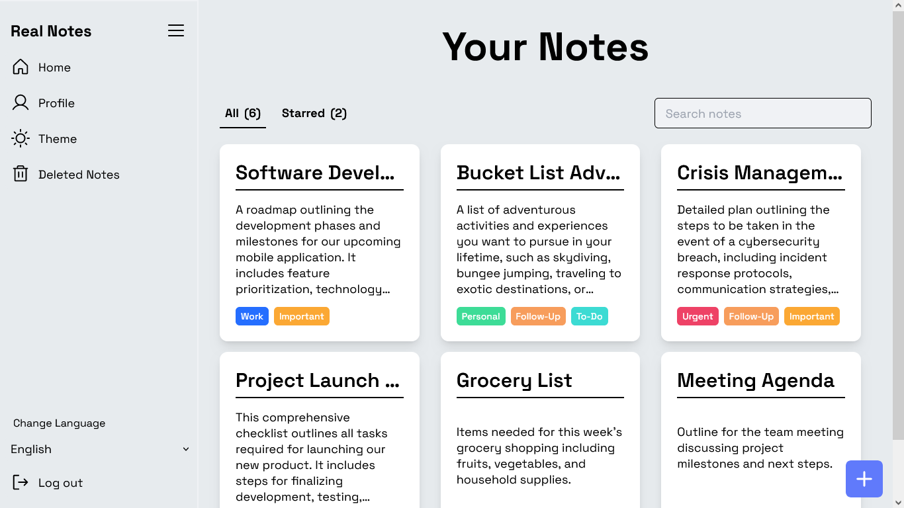

# Real Notes - Your Notes, Your Wish



A note-taking application with CRUD operations, authentication, profile management, multi-language support, and customizable themes.

## 🔮 Features

-   **📝 CRUD Features:** Create, Read, Update, and Delete notes easily.
-   **⭐ Star Notes:** Highlight important notes with stars for quick access.
-   **🔒 User Authentication:** Encourages secure authentication to protect user data.
-   **🔄 Profile Sync:** Syncs user profiles at login time to deliver a tailored experience.
-   **🏷️ Labels for Priority of Notes:** Places note**s with labels to show their top priority.
-   **🔍 Recovery Option for Deleted Notes:** Restore deleted notes from sync history.
-   **🌐 Multi-language Support:** Cater to various user needs with support for many languages.
-   **🌞🌚 Light and Dark Theme:** Toggle between light and dark themes for convenient use.
-   **👤 Profile Page:** Modify account settings like changing password, resetting password, and deleting an account.
-   **📱 Full Responsive:** Enjoy a seamless experience across all devices, ensuring accessibility and usability.

## 🚀 Live Preview

You can view the live preview of the project [here.](https://realnotes.netlify.app)

## 💻 Tech Stack


## ⚙️ Installation

1. **Fork this repository:** Click the Fork button located in the top-right corner of this page to fork the repository.
2. **Clone the repository:**
    ```bash
    git clone https://github.com/<your-username>/Real-Notes.git
    ```

3. **Set up Firebase configuration:** 
   - Create a Firebase project at Firebase Console. 
   - Obtain your Firebase configuration credentials.
   - Create a .env file in the root directory of your project.
   - Add your Firebase configuration credentials to the `.env` file:
    ```bash
    VITE_API_KEY=<your-api-key>
    VITE_AUTH_DOMAIN=<your-auth-domain>
    VITE_PROJECT_ID=<your-project-id>
    VITE_STORAGE_BUCKET=<your-storage-bucket>
    VITE_MESSAGING_SENDER_ID=<your-messaging-sender-id>
    VITE_APP_ID=<your-app-id>
    ```

1. **Install dependencies:**
   Navigate to the frontend and backend directories separately and run:
    ```bash
     npm install
    ```
2. **Start the development server:**  
    ```bash
    npm run dev
    ```
3. **Access the application:**
   Open a browser and enter the following URL:
    ```bash
    http://localhost:5173/
    ```

## 🌟 Support Us

If you find this helpful or valuable, please consider 🌟 starring the repository. It helps us gain visibility and encourages further development. We appreciate your support!

## 🧾 License

This project is licensed under the [MIT License](LICENSE).

## ✍️ About Developer

-   Sahil Atahar (Aspiring Full Stack Developer)  
     [](https://github.com/sahilatahar)
    [](https://linkedin.com/in/sahilatahar)


